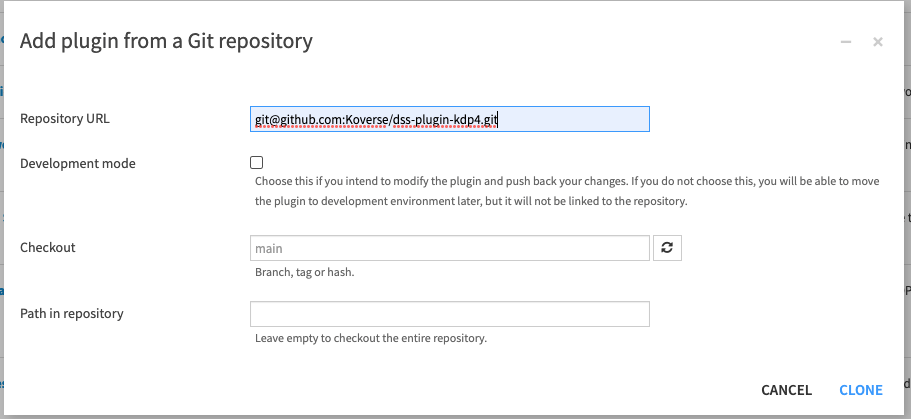
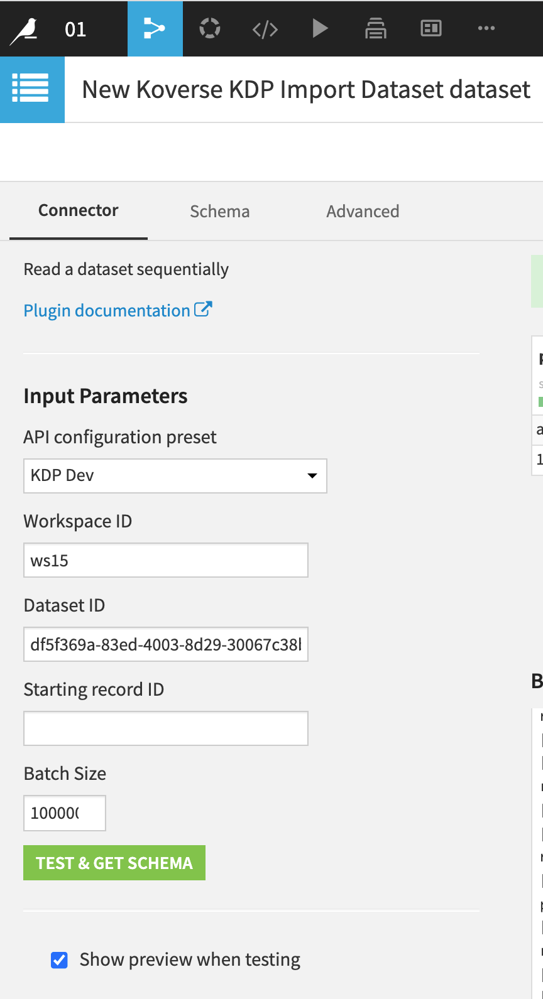

# dss-plugin-kdp4

## Connector for Dataiku DSS to connect with the Koverse Data Platform (KDP4)

### Installation

The plugin can be installed from the plugin page in Dataiku DSS:


**Repository URL** (use either of)

- git@github.com:Koverse/dss-plugin-kdp4.git
- https://github.com/Koverse/dss-plugin-kdp4.git




Next step is to create a code environment for the plugin (which installs needed dependencies:
                                                          kdp-python-connector, kdp-api-python-client)


After installation of the plugin, The 'Koverse KDP' plugin will be accessible from the DATASET menu of the Flow
in dataiku DSS.
Example:


### Create Dataiku Preset

Under the **Settings** tab, create a preset for **API configuration**


There are two supported authentication methods, **basic_login** and **json web token**. KDP plugin will use the method you choose for **Authentication method** when connecting to KDP.

#### Basic Login


#### KDP JSON Web Token


### Write data from Dataiku DSS to KDP

Select the 'Koverse KDP Dataset' which is a dataiku custom dataset for writing data to KDP.
Reading from KDP is also supported by the 'Export' dataset.


Provide required parameters and name for the dataset. When using an existing KDP dataset, the existing data can
be previewed:


### Read and Import Dataset from KDP

Select the 'Koverse KDP Import Dataset' which is a dataiku custom dataset for reading and importing data from KDP.
The 'import' dataset does not support writing data to kdp4.


Provide required parameters and name for the dataset:




### For development: Creating new version of plugin

You can test changes outside DSS with the use_connector example (following the instructions contained in that example),
or add additional examples/tests in the same pattern. It will require the dependencies listed in requirements.txt
to be installed (code-env/python/spec/requirements.txt)

From kdp-dataiku-connector root... (may require sudo, or use of venv)

```pip install -r code-env/python/spec/requirements.txt```

Testing in Dataiku DSS can be done by importing the plugin as detailed in the steps above.
A feature branch can be targeted and imported. Also the plugin once installed can be converted
to a development plugin in DSS by selecting the menu option from ACTIONS as seen here...


You can then edit in the DSS application, you will have to refresh any open DSS page after saving changes.  
DSS does have git integration, you can push changes out from DSS to the feature branch as you work with the plugin.  

Version should be manually updated in the plugin.json to the new minor version and also update the version in setup.py.